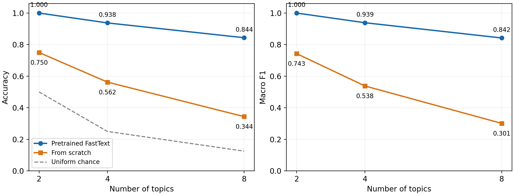
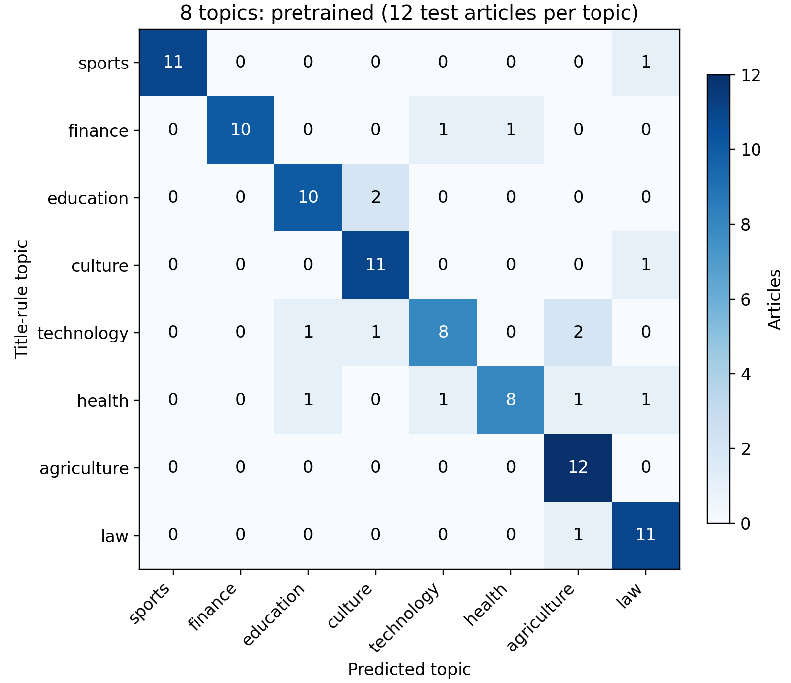

GitHub 项目：[gensim-fasttext-assignment](https://github.com/abyssiphix/gensim-fasttext-assignment)

# Gensim 词语表示学习与 fastText 文本分类实验报告

## 1 实验目标与主要结果

本实验完成了词向量学习和新闻主题分类两个阶段。Word2Vec 与 Gensim FastText 使用同一份外部新闻语料训练；再将 FastText 词向量导入官方 fastText 分类器，与从零初始化进行比较。在 8 类、每类 48 篇训练文章的设置下，预训练模型答对 81/96 篇，准确率为 0.844，宏平均 F1 为 0.842；从零训练答对 33/96 篇，准确率为 0.344。该结论只适用于本次固定样本和弱标签。

所有表格和图均来自本次实际运行。截图中的近邻、准确率及训练时间仅作为实验流程参考，没有作为本次结果使用。

### 两阶段学习方法

表示学习阶段采用 skip-gram，通过上下文共现学习词的向量。Word2Vec 为词表中的词学习独立向量；FastText 还学习字符 n-gram，并将子词信息组合到词表示中，因此可以为部分未见词合成向量。[1][2]

分类阶段输入带主题标签的整篇文章。分类器将词与词二元组形成文章表示，再学习文章表示到类别的映射。Gensim FastText 没有监督分类接口，本实验调用官方 fasttext.train_supervised，并显式设置 pretrainedVectors。[3]

### 两套语料的用途

| 语料 | 本次规模 | 用途 |
| --- | --- | --- |
| THUCNews 十类正文副本 | 10000 篇原始新闻，9815 篇进入训练 | 外部无标注词向量学习 |
| PeopleDaily1998 | 18647 篇恢复文章，选取 8 类共 480 篇 | 固定训练集和留出测试集 |

THUCNews 使用公开仓库中 cnews.test.txt 的全部 10000 行，每类 1000 行，原文件的主题标签不进入表示学习。它与截图的 836075 条镜像固定位置抽样不同。下载文件的大小及 SHA-256 与 Git LFS 指针一致，但不能据此认定不同镜像的内容完全相同。具体版本和校验值保存在 data/sources.json。[4]

PeopleDaily1998 压缩包实际包含 1998 年 1-6 月。源语料提供文章和句子编号、分词及词性，没有本实验的八个主题标签；本次依据标题规则制作弱标签并检查排除明显误命中的候选。[5]

## 2 词向量训练与近邻分析

THUCNews 先统一全半角字符，去除空文本、少于 100 个非空白字符的短文本和正文重复项；按句末标点和换行切分，再用 jieba 分词。保留含中文、字母或数字的词，删除不足三个词项的片段。最终得到 193,931 个句子、4,635,184 个词项，两个模型读取完全相同的 sentences.txt.gz。

| 参数 | Word2Vec 与 FastText |
| --- | --- |
| 训练目标与维度 | skip-gram，100 维 |
| 上下文与词频 | 窗口 5，最低词频 3 |
| 训练设置 | 5 轮，负采样 5，sample=0.001 |
| 学习率 | alpha=0.025，min_alpha=0.0001 |
| 随机性控制 | 单线程，seed=42，PYTHONHASHSEED=0 |
| FastText 子词 | 长度 2-4，200000 个哈希桶 |

最终词表均为 65,991 个词。本机训练耗时分别为 Word2Vec 141.5 秒、FastText 175.3 秒。这是同一机器上的单次测量，不能作为模型普遍速度排名。

### 四个查询词的前三个近邻

| 查询词 | Word2Vec | FastText |
| --- | --- | --- |
| 银行 | 商业银行、金融机构、券商 | 抢银行、外资银行、渣打银行 |
| 学校 | 学生、院校、中学 | 教会学校、小学校、私校 |
| 电脑 | 彩信、bw17、kong | 电脑桌、电脑前、电脑软件 |
| 经济 | 复苏、宏观经济、关键时期 | 经济圈、会展经济、非经济 |

FastText 将“抢银行”列为“银行”的首个近邻，说明共享字符不保证含义相同。Word2Vec 的“电脑”近邻含 bw17、kong，可能受到产品参数及共现噪声影响。四个查询词不能代表整个词表质量；前五近邻及余弦值见 embedding_results.json。

### 预先指定词组的平均相似度

体育组为足球、篮球、比赛、球队；金融组为银行、股票、贷款、利率；教育组为学校、学生、教师、教育；科技组为电脑、软件、网络、科技。每组计算 6 个词对，共 24 个组内词对；不同组之间共 96 个词对。所有词都在两个模型的词表中。

| 模型 | 组内均值 | 组间均值 | 组内减组间 |
| --- | --- | --- | --- |
| Word2Vec | 0.5498 | 0.2520 | 0.2978 |
| FastText | 0.5964 | 0.2661 | 0.3302 |

余弦相似度按向量点积除以两向量范数计算。组内和组间值都升高，可能同时包含语义接近及整体相似度偏高的影响，因此还观察二者差值。这里的 16 个词是小规模诊断集合，不能替代带人工评分的相似度基准。

## 3 词表外词与分类实验设置

### 词表外词查询

提前指定三个复合新词，并用 key_to_index 检查它们都没有进入词表。Word2Vec 对三个词均无法直接查询；Gensim FastText 均返回了有限的非零向量。这里不能用“word in fasttext.wv”判定词表成员，因为该表达式可能对可合成的词表外词也返回真。

| 词表外词 | FastText 向量范数 | 首个近邻 |
| --- | --- | --- |
| 量子计算芯片 | 1.6965 | 科幻影片 |
| 超导量子云平台 | 1.4960 | 跨平台 |
| 火星智能农场 | 1.5571 | 昏昏欲睡 |

“量子计算芯片”的首个近邻为“科幻影片”，“火星智能农场”靠近“昏昏欲睡”，均与预期主题相距较远。这直接说明返回有限向量不能证明理解新词；子词共享、哈希碰撞与训练语料偏差可能影响合成表示。

### 文章恢复与弱标签

按日期、版面和文章号合并同一文章的句子，按句号编号排序。首行恢复为标题，其余各行恢复为正文，移除编号、词性和嵌套标注的方括号，保留现成分词。候选文章须标题长度 5-60 字、正文不少于 80 个词项且仅命中一个主题规则；正文重复项不再选取。

候选检查排除了“通信手稿”中书信义的通信、足球裁判执法、天文学被误命中文学等情况，也排除了若干主题明显混合的报道。排除清单在分类训练之前固定，保留具体文章 ID 和理由。标签仍以标题规则为基础，并非独立专家提供的主题金标准。

每类按 SHA-256(42:select:文章ID) 排序取 60 篇，再按 SHA-256(42:split:文章ID) 排序，前 12 篇留作测试，余下 48 篇训练。2、4、8 类实验使用嵌套类别，同一类别的文章及划分保持一致。

| 类别数 | 类别 | 训练与测试 |
| --- | --- | --- |
| 2 | 体育、金融 | 96 / 24 |
| 4 | 再加入教育、文化 | 192 / 48 |
| 8 | 再加入科技、医疗、农业、法治 | 384 / 96 |

### 监督训练参数

分类输入仅使用标题之后各行的正文，最多前 500 个词项。输入格式为每行一个 `__label__topic` 加空格分词正文。分类器设置 100 维、学习率 0.3、25 轮、wordNgrams=2、softmax、单线程、种子 42、minCount=1，字符片段参数 minn=maxn=0。两种初始化共用 200000 个哈希桶；这一显式设置与截图未列出的默认桶数可能不同。

预训练组通过 pretrainedVectors 导入 Gensim FastText 的合成词向量 .vec，导出文件不含子词哈希矩阵；从零组只去掉该参数。导入词向量后分类器继续进行监督训练。预训练词表覆盖本次输入词项的 78.5%。

## 4 分类结果与观察

| 类数 | 预训练答对 | 预训练准确率 | 预训练宏 F1 | 从零答对 | 从零准确率 | 从零宏 F1 |
| --- | --- | --- | --- | --- | --- | --- |
| 2 | 24/24 | 1.000 | 1.000 | 18/24 | 0.750 | 0.743 |
| 4 | 45/48 | 0.938 | 0.939 | 27/48 | 0.562 | 0.538 |
| 8 | 81/96 | 0.844 | 0.842 | 33/96 | 0.344 | 0.301 |

准确率为正确预测数除以测试文章总数。宏平均 F1 先对每类分别计算精确率、召回率和 F1，再对类别等权平均；零分母按 0 处理。图中的随机基线只表示各类等概率猜测的理论准确率，没有把它当作宏平均 F1 的等价基线。

图 1 同一文章划分下的预训练与从零训练对照

8 类任务中，预训练组相对从零组多答对 48 篇，准确率差为 50.00 个百分点。结合每类仅 48 篇训练文章的条件，该结果支持外部无标注词向量在本次小样本设置中有帮助。

类别增加时，模型需要区分更多相邻主题；同时总训练文章数和测试文章数也增加，因此曲线不是只改变类别数的纯变量实验。每类训练量保持 48 篇，能控制单类样本规模，但主题组成的变化也会影响难度。

8 类预训练模型使用相同数据和参数重训一次，96/96 篇测试文章的预测一致。这支持本环境中本次运行的可复现性，不能替代多个随机种子与多个数据划分的稳定性评估。

## 5 八类混淆与错误案例

图 2 八类预训练模型混淆矩阵 纵轴为标题规则标签

每行共 12 篇测试文章；预训练模型共错分 15 篇。混淆矩阵展示弱标签与预测之间的差异，不能把每个非对角项都直接解释为唯一语义答案上的错误。

案例 1 19980507-08-006：体育 → 法治。报道主体是游泳选手禁赛，但正文出现体育仲裁法庭、违反政策和处罚等表达。模型预测法治，可能受到这些司法与处罚词汇影响；这属于体育事件与规则执行的交叉。

案例 2 19980421-07-005：医疗 → 教育。报道主题是公共卫生研究资助，正文同时涉及公共卫生学院、耶鲁大学、课程教学和学生实习。医疗与教育词汇重叠，可以解释这一预测的合理性，但不能单凭词频确定模型的因果依据。

案例 3 19980407-01-003：科技 → 农业。标题以电脑技术命中科技规则，正文介绍传感器调节温湿度，以及蔬菜种植和亩产。模型预测农业，表明按技术手段与按应用领域标注会得到不同答案，也暴露了单标签规则的边界。

完整正文、分数和逐篇预测随包提供。分类器分数未经校准；上述解释来自文本内容，是可能的误差来源。本次保留冻结后的全部预测，不依据测试错误修改标签或参数。

## 6 局限 扩展与复现

### 结果的适用范围

本实验只有一个固定文章划分，8 类共 96 篇测试文章。每错一篇，准确率就变化约 1.04 个百分点，因此小数点后三位只是计算精度，不能表示同等程度的估计精度。两个初始化方法结果的差异也没有经过多次独立划分的显著性检验。

标题规则选择的报道通常包含明显主题词，可能比随机新闻更容易分类。去掉首行标题降低了模型直接读取选样关键词的风险，但正文往往仍出现相关词，这种选样偏差并未消失。原始文件缺少统一的完整标题边界标记，首行之外的副标题或导语也可能残留；这限制了对“仅正文”条件的严格解释。

THUCNews 与 1998 年人民日报的时代、来源和分词方式不同。FastText 词向量效果受子词参数和词项边界影响，词组实验只有 16 个词。模型间的近邻或余弦差异不能自动等价于下游分类能力差异。

### 可继续开展的实验

扩大外部语料，按类别分层抽样并控制每次训练词项总数，记录性能与资源消耗；增加多个随机种子和文章划分，报告均值与标准差。可加入 Word2Vec 平均词向量加线性分类器、Doc2Vec 等对照，比较相同训练数据下的效果。若研究监督阶段子词信息，应另设 minn/maxn 非零的实验组，并与词向量导入的作用分别比较。

### 运行与审计

解压作业包后安装 requirements.txt，再运行 python run.py all。入口自动设置随机哈希种子并依次执行词向量训练、六组分类、绘图和审计。固定分词文件和文章划分已随包提供，默认无需重新联网。

本次审计通过：480 个文章 ID 唯一，正文哈希无重复，训练与测试没有共享文章；2/4/8 类划分嵌套；分类文件逐行等于固定正文输入；准确率和宏 F1 可由逐篇预测重新计算，混淆矩阵总数一致。数据及结果校验值见 checksums.json。

### 参考资料

[1] [Gensim Word2Vec 文档](https://radimrehurek.com/gensim/models/word2vec.html)

[2] [Bojanowski 等 Enriching Word Vectors with Subword Information](https://arxiv.org/abs/1607.04606)

[3] [官方 fastText Python 接口及监督训练参数](https://fasttext.cc/docs/en/python-module.html)

[4] [THUCNews 正文副本及固定版本](https://github.com/qingyujean/document-level-classification/tree/5f63589fc17ab3ac360e74fc96f67d3f42e04780)

[5] [PeopleDaily1998 数据仓库](https://github.com/chenhui-bupt/PeopleDaily1998)

[6] [Joulin 等 Bag of Tricks for Efficient Text Classification](https://arxiv.org/abs/1607.01759)
